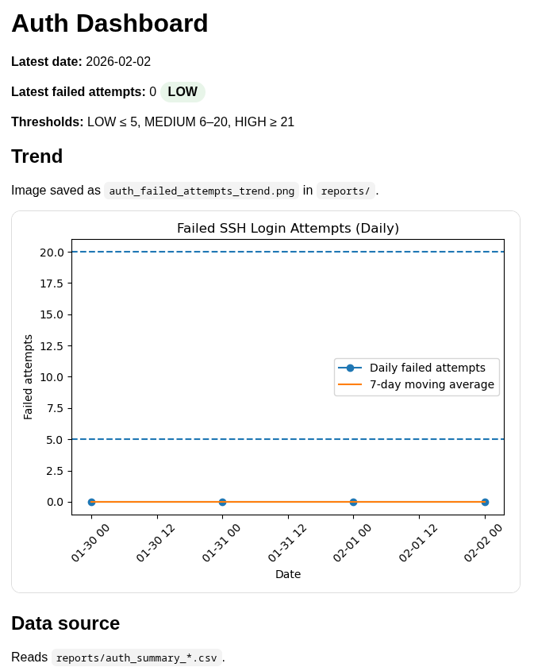

# Blue Team Fundamentals

**Installable agent:** CLI + systemd automation  
**Use case:** Daily Linux Blue Team routine with reports and dashboard

**Status:** Operational   
**Latest release:** v1.0.3 — Product Packaging & Installer

---

## Overview

Blue Team Fundamentals is a Linux-focused defensive security project that
implements a **daily operational Blue Team routine**.

It combines file integrity monitoring, authentication log analysis, service
health checks, automated reporting, and a local visual dashboard — packaged
as an **installable agent** with a CLI and systemd automation.

This project is designed to reflect **real SOC and Blue Team workflows**,
with an emphasis on signal over noise, least privilege, and operational clarity.

---

## Key Features

- File Integrity Monitoring (FIM) with whitelist and exit codes
- SSH authentication log monitoring with severity levels
- Service health checks for critical system services
- Daily master security report generation
- Local dashboard (HTML + PNG) with trends and severity
- Installable CLI (`blueteam`)
- Automation via systemd user service + timer
- Minimal-privilege sudo configuration

---

## Quick Start
```bash
blueteam run
blueteam enable
blueteam status

### Run once (manual)
```bash
cd scripts-blue-team
./run_all_security.sh

## Dashboard Preview




